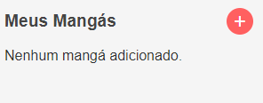

# MangaBook

MangaBook é uma extensão de navegador que ajuda você a acompanhar a leitura dos seus mangás favoritos. Com o MangaBook, você pode facilmente salvar o capítulo onde parou e continuar sua leitura de onde deixou, sem nunca mais perder o fio da história.

## Funcionalidades

- **Salvar Capítulo Atual**: Salve o capítulo atual do mangá que você está lendo diretamente no seu navegador.
- **Lista de Mangás**: Mantenha uma lista dos mangás que você está acompanhando, incluindo o título e o capítulo atual.

## Images

 <br>
*Interface principal do MangaBook*

 <br>
*Lista de mangás salvos*

## Instalação

1. Clone o repositório para sua máquina local:

    ```bash
    git clone https://github.com/seu-usuario/mangabook.git
    ```

2. Navegue até `chrome://extensions/` no seu navegador Chrome.

3. Ative o "Modo do desenvolvedor" no canto superior direito.

4. Clique em "Carregar sem compactação" e selecione a pasta do projeto MangaBook que você clonou.

5. A extensão MangaBook agora está instalada e pronta para uso!

## Uso

1. **Adicionar Mangá**: Abra a extensão clicando no ícone do MangaBook na barra de ferramentas do navegador. Insira o título do mangá e o capítulo atual, e clique em "Salvar".

2. **Verificar sua Lista**: Veja a lista dos mangás que você está acompanhando diretamente na interface da extensão.

## Atenção

Os dados ainda estão sendo armazenados em Local Storage! 

## Contribuição

Contribuições são bem-vindas! Sinta-se à vontade para abrir issues ou enviar pull requests para melhorar o MangaBook.

