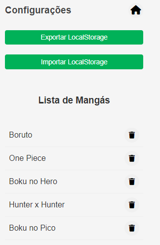

# MangaBook

MangaBook é uma extensão de navegador que ajuda você a acompanhar a leitura dos seus mangás favoritos, você pode facilmente salvar o capítulo onde parou e continuar sua leitura de onde deixou, sem esquecer o que já leu. 

Sabe aquele hiato que você da nas suas leituras e depois não sabe onde parou? Chega disso! 

## Images

 <br>
*Interface para adicionar um manga do MangaBook*

 <br>
*Interface para editar um manga do MangaBook*


 <br>
*Lista de mangás cadastrados no MangaBook*

 <br>
*Tela de configuração do MangaBook*

 <br>
*Tela de configuração do MangaBook com Search*

 <br>
*Sistemas de Tags MangaBook com Search*

## Instalação

1. Clone o repositório para sua máquina local:

    ```bash
    git clone https://github.com/seu-usuario/mangabook.git
    ```

2. Navegue até `chrome://extensions/` no seu navegador Chrome.

3. Ative o "Modo do desenvolvedor" no canto superior direito.

4. Clique em "Carregar sem compactação" e selecione a pasta do projeto MangaBook que você clonou.

5. A extensão MangaBook agora está instalada e pronta para uso!


## Atenção

Os dados ainda estão sendo armazenados em Local Storage. Breve será implementado uma persistencia de dados! Até lá, não limpe o Local Storage... 

## Contribuição

Contribuições são bem-vindas! Sinta-se à vontade para abrir issues ou enviar pull requests para melhorar o MangaBook.

